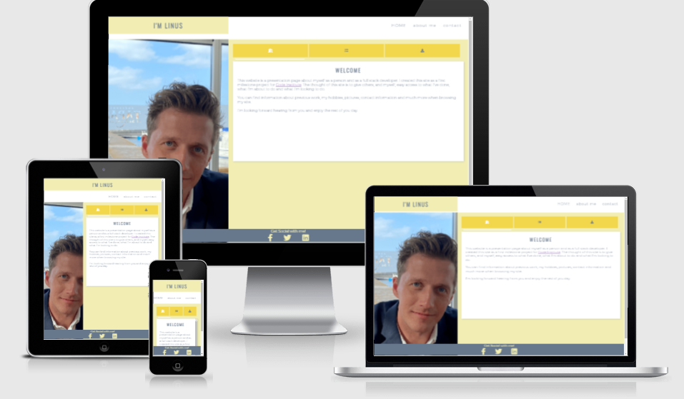
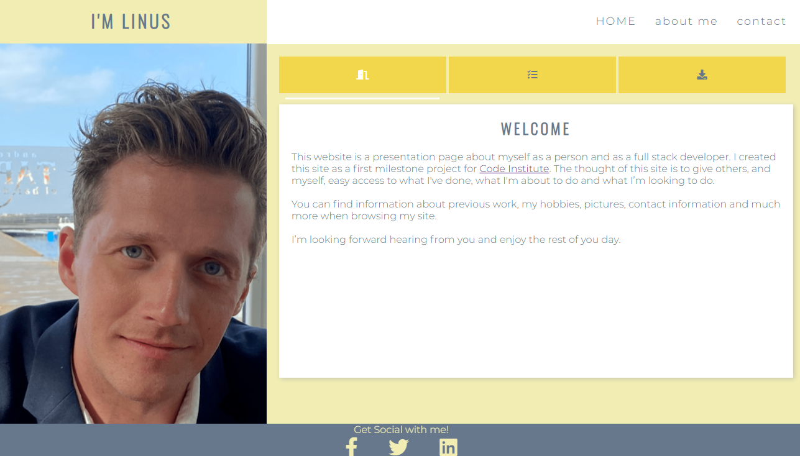
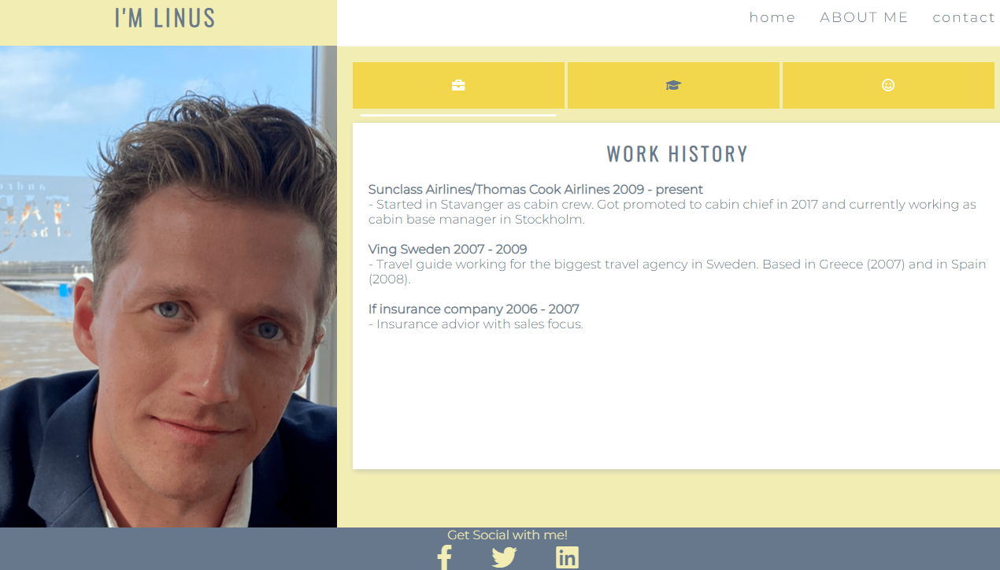
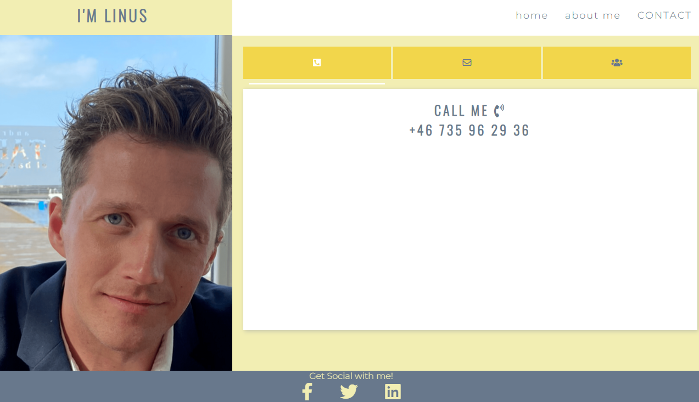
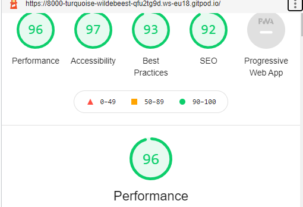

# My Biography/Resume Page

[Veiw the project here](https://linushf.github.io/bio-resume/)

## Table of contents
* [General info](#general-info)
* [User stories](#user-stories)
* [Features](#features)
* [Technologies](#technologies)
* [Wireframes](#wireframes)
* [Testing](#testing)
* [Deployment](#deployment)
* [Credit](#credit)

## General info

This is a biography page that can be used for showing off my previous work, ongoing projects, upcoming projects a little bit about myself as a person.

The purpose is to get in contact with potential employers and show off my work. 

This page is a milestone project to become a Full Stack Developer. The course is provided by [Code Inistitute](https://codeinstitute.net/).

## User stories
As visiting user, I would like to know the professional experience of site ower

## Features
The features on this page are coded in a way so the user can navigate anywhere with just 1 click. The navigation bar and footer are therefore on all pages and identically  designed.
### Existing Features

- __Navigation Bar__

    Is featured on all pages for easy navigation and making the design easy to recognize.
- __Footer__

    The footer is shown on all pages on site. The idea is to give the site a nice framing and easy access to social media links. 

- __Slider__

    All tabs are "connected" to a slider that underlines the tab that is selected. It slides whenever a tab I clicked and stays in position until a different tab is selected. 
- __Landing Page__

    The landing page is the home page. There are three tabs for the user to quickly access my ongoing projects, a downloadable resume, and a side letter.
    
- __About Me Page__

    The page is provided with three tabs. One to view my work history, one to view my education och one tab to view some pictures of me. Always good to put a face to text. 
    
- __Contact page__

    The page is provided with three tabs. Super easy - one tab for e-mail, one for telephone number, and one for social media. 
    

### Future features
There are some more features that I would've like to add if I had more time.
- __Contact me form__

    For potential employers to contact me.
- __Picture slides__

    An easier way to view pictures of me would be to have a slide show instead of having the pictures as pop-ups.

## Technologies
- __Languages__
    - HTML5
    - CSS3
- __Framework, Libaries & Programs Used__
    - Git - for the workspace 
    - Github - for the deployment
    - Font Awesome - for the symbols
    - Google Fonts - for the fonts
    - Adobe Color - for the color scheme
    - W3 School - for tables
    - CodeConvey - for the tab funtion

## Wireframes
I used Balsamiq to bulid these wiresframes.
    

## Testing
- __Validator__
    - HTML - WC3 - no errors were returned when passing all pages through the official W3C Validator
    
    - CSS - Jigsaw - no errors were returned when passing through the official (jigsaw) Validator
    - Accessibility - I generated a report in devtool lighthouse to make sure that colors and fonts are easy to read and accessible.
    
    
    

- __Test cases__

- __Fixed bugs__

- __Browsers__
    - I have tested that this page works when using different web browsers such as Safari, Chrome, Firefox, and Edge. 
- __Responsiveness__ 
    - I have confirmed that the design is responsive and all functions work on different screen sizes. 

## Deployment

- __Gitpod__

- __GitHub pages__

## Credit
- __Code__
    - To create a functional and good looking tab CSS I got inspiration from [CodeConvey](https://codeconvey.com/animated-content-tabs-with-css3/) and table for downloadable files (in Home -> right tab) was inspired by the table I found on [W3 Schools](https://www.w3schools.com/html/tryit.asp?filename=tryhtml_table_intro)
- __Content__
    - Text is written by myself.
- __Media__
    - Pictures on site are my own, the picture on top of this README is generated from. [Am I Responsive](http://ami.responsivedesign.is/)
    - Video is embedded from [YouTube](http://www.youtube.com/)
    - Colors on this page is a set of colors that I found on Adobe Colors [webpage](https://color.adobe.com/ "Adobe Colors") 
- __Acknowledgement__
    - Code institute tutor service has helped me a lot when I was facing issues with coding and design.

[See more of my work on GitHub](https://www.github.com/linushf)