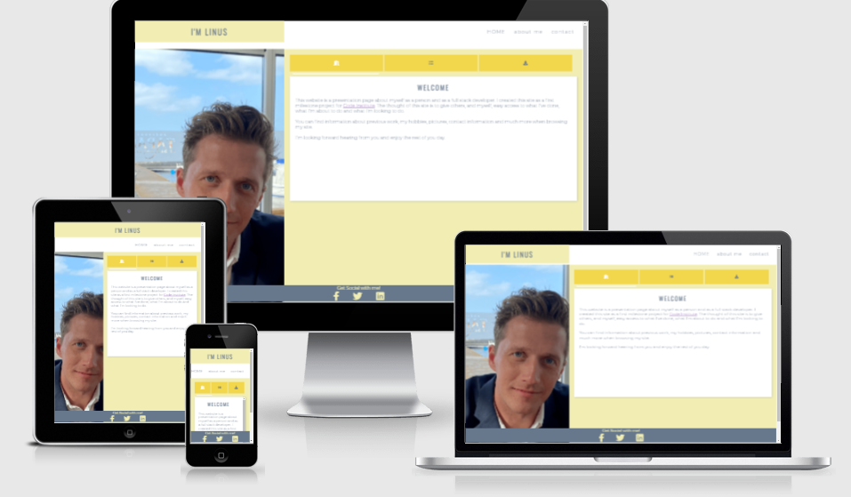
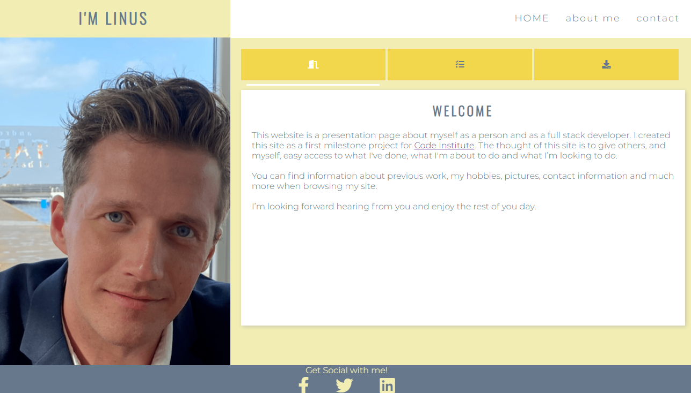
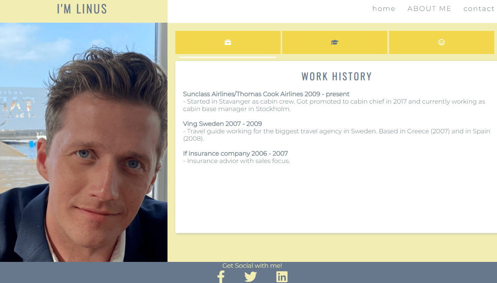
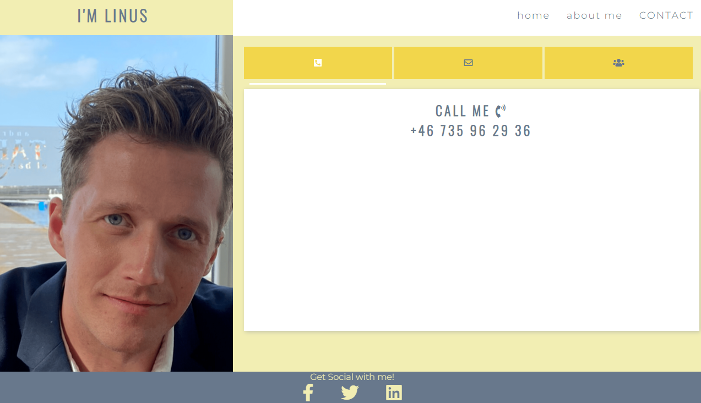
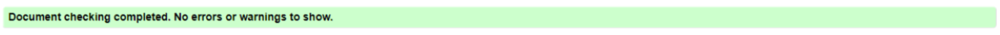
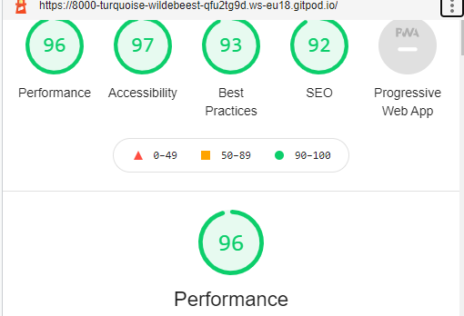

# My Biography/Resume Page

[Veiw the project here](https://linushf.github.io/bio-resume/)

## Table of contents
* [General info](#general-info)
* [Features](#features)
* [Technologies](#technologies)
* [Testing](#testing)
* [Credit](#credit)

## General info

This is a biography page that can be used for showing off my previous work, ongoing projects, upcoming projects a little bit about myself as a person.

The purpose is to get in contact with potential employers and showing off my work. 

This page is a milestone project to become a Full Stack Developer. The course is provided by [Code Inistitute](https://codeinstitute.net/).

## Features
The features on this page are coded in a way so the user can navigate anywhere with just 1 click. The navigationbar and footer are therefore in all pages and identical designed.
### Existing Features

- __Navigation Bar__

    Is featured on all pages for easy navigation and making the design easy to recognize.
- __Footer__

    The footer is show on all pages on site. The idea is to give the site a nice framing and easy access to social media links. 

- __Slider__

    All tabs are "connected" to a slider that underlines the tab that is selected. It slides whenever a tab i clicked and stays in position until a different tab is selected. 
- __Landing Page__

    The landing page is the home page. There are three tabs for the user to quickly access my ongoing projects, downlaodable resume and side letter.
    
- __About Me Page__

    The page is provided with three tabs. One to view my work history, one to view my education och one tab to view some pictures of me. Always good to put a face to text. 
    
- __Contact page__

    The page is provided with three tabs. Super easy - one tab for e-mail, one for telephone number and one for social media. 
    

## Technologies
- __Languages__
    - HTML5
    - CSS3
- __Framework, Libaries & Programs Used__
    - Git
    - Github
    - Font Awesome
    - Google Fonts
    - Adobe Color
    - W3 School
    - CodeConvey

## Testing
- __Validator__
    - HTML - WC3 - no errors was returned when passing through the official W3C Validator
    
    - CSS - Jigsaw - no errors was returned when passing through the official (jigsaw) Validator
    - Accessibility - I generated a report i devtool lighthouse to make sure that colors and fonts are easy to read and accessible. 
    

- __Browsers__
    - I have tested that this page works when using different web browsers such as Safari, Chrome, Firefox and Edge. 
- __Responsiveness__ 
    - I have confired that the design is responsive and all functions works on different screen sizes. 

## Credit
- __Code__
    - In order to create a functional and good looking tab CSS i got inspiration from [CodeConvey](https://codeconvey.com/animated-content-tabs-with-css3/) and table for downloadable files (in Home -> right tab) was inspired by table I found on [W3 Schools](https://www.w3schools.com/html/tryit.asp?filename=tryhtml_table_intro)
- __Content__
    - Text is written by myself.
- __Media__
    - Pictures on site are my own, picture on top of this README is generated from. [Am I Responsive](http://ami.responsivedesign.is/)
    - Colors on this page is a set of colors that i found on Adobe Colors [webpage](https://color.adobe.com/ "Adobe Colors") 
- __Acknowledgement__
    - Code institute tutor service has help me a lot when i was faceing issues with coding and design.

[See more of my work on GitHub](https://www.github.com/linushf)