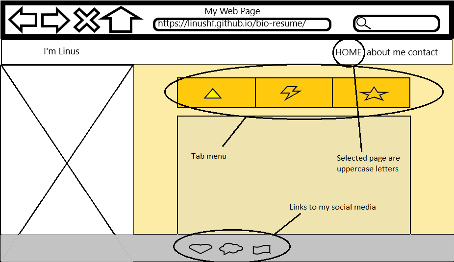
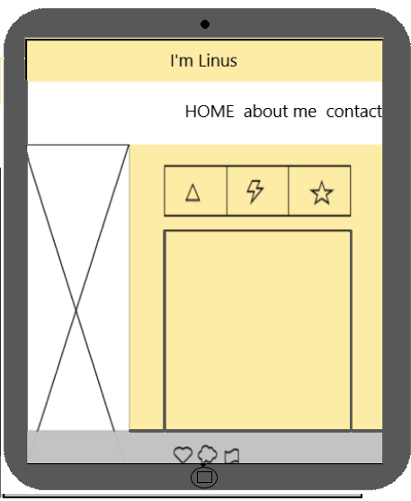
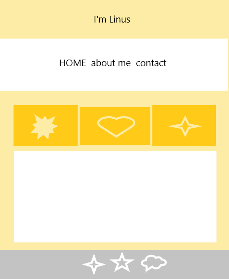
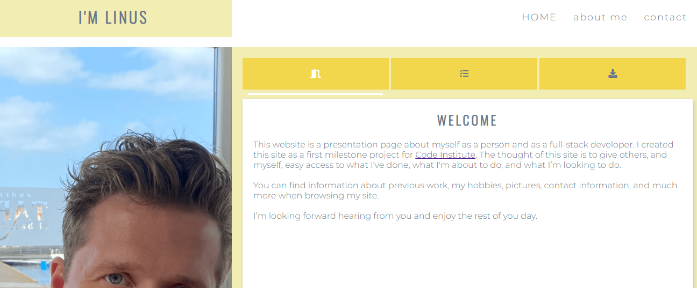
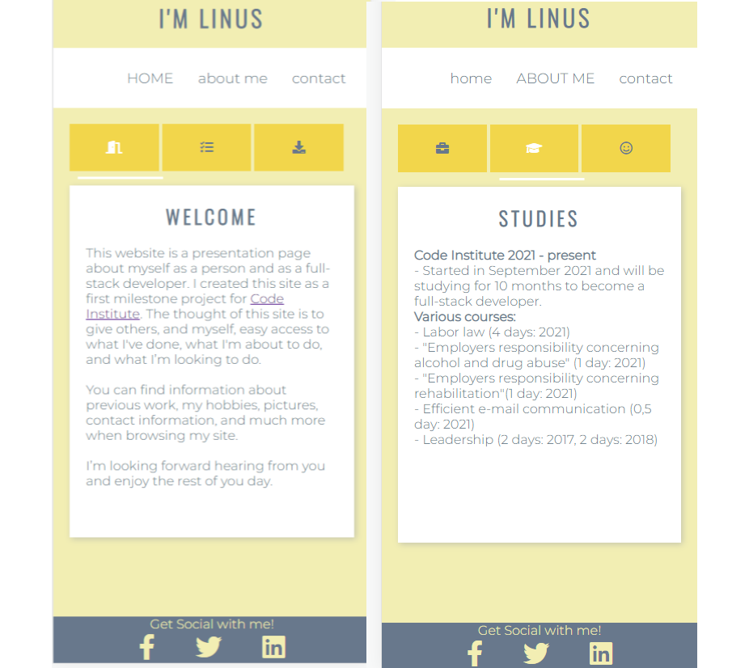

# My Biography/Resume Page

[Veiw the project here](https://linushf.github.io/bio-resume/)

## Table of contents
* [General info](#general-info)
* [User stories](#user-stories)
* [Features](#features)
* [Technologies](#technologies)
* [Testing](#testing)
* [Deployment](#deployment)
* [Credit](#credit)

## General info

This is a biography page that can be used for showing off my previous work, ongoing projects, upcoming projects a little bit about myself as a person.

The purpose is to get in contact with potential employers and show off my work. 

This page is a milestone project to become a Full Stack Developer. The course is provided by [Code Inistitute](https://codeinstitute.net/).

## User stories
- __Design__

  - The design is simplistic and uses contrast colors to display the main content. It has a clear navigation menu and it is easy to go from one page to another.
  - The fonts are easy to read and contribute to a better user experience.

- __Visual Idea__
  - Wireframes were created in Windows Paint.

  - The ideas have since grown little by little as project is made and features has been added.

- __User Stories__

    - As a user I want to know what the page is about.

    - As a user I want to navigate between pages.

    - As a user I want to be able to make contact with site owner.

    - As a user I would like to view images and read resume.

    - As a user I want the social media links to work.

## Features
The features on this page are coded in a way so the user can navigate anywhere with just 1 click. The navigation bar and footer are therefore on all pages and identically  designed.
### Existing Features

- __Navigation Bar__

    Is featured on all pages for easy navigation and making the design easy to recognize.
- __Footer__

    The footer is shown on all pages on site. The idea is to give the site a nice framing and easy access to social media links. 

- __Slider__

    All tabs are "connected" to a slider that underlines the tab that is selected. It slides whenever a tab I clicked and stays in position until a different tab is selected. 
- __Landing Page__

    The landing page is the home page. There are three tabs for the user to quickly access my ongoing projects, a downloadable resume, and a side letter.
    
- __About Me Page__

    The page is provided with three tabs. One to view my work history, one to view my education och one tab to view some pictures of me. Always good to put a face to text. 
    
- __Contact page__

    The page is provided with three tabs. Super easy - one tab for e-mail, one for telephone number, and one for social media. 
    

### Future features
There are some more features that I would've like to add if I had more time.
- __Contact me form__

    For potential employers to contact me.
- __Picture slides__

    An easier way to view pictures of me would be to have a slide show instead of having the pictures as pop-ups.

## Technologies
- __Used__
    - GitPod for developing the code
    - GitHub for deploying the project
    - HTML code
    - CSS for styling
    - Font Awesome - web page for icons
    - Google Fonts - for the fonts
    - Adobe Color - for the color scheme
    - DevTools for developing the code

## Testing
- __Validator__
    - HTML - WC3 - no errors were returned when passing all pages through the official W3C Validator
    
    - CSS - Jigsaw - no errors were returned when passing through the official (jigsaw) Validator
    - Accessibility - I generated a report in devtool lighthouse to make sure that colors and fonts are easy to read and accessible.
    
    
    

- __User stories testing__

    - As a user I want to know what the page is about.
        - On the landing page, the user is greeted with webpage information och what to find on the webpage.
            

    - As a user I want to navigate between pages.
        - Navigation links are at the top right. The user can identify the page that they are on by viewing the menu where the active page is in uppercase letters. Navigation is made easy and consistent.

    - As a user I want to be able to make contact with site owner.
        - In the footer, there are icon links to my social media. The footer is displayed on all pages and if the user clicks 'contacts' in the menu they'll be presented with more contact information such as e-mail and telephone number.

    - As a user I would like to view images and read resume.
        - When the user navigates to the download symbol on the home page the files are presented in a table for the user to choose which resume file to download.

    - As a user I want the social media links to work.
        - The social media link in the footer works. If the user navigates to the contact page and clicks on the social media tab the user will also get three options of which social media they would like to open. All links are opened in a new window.

- __Bugs__
    - There are no bugs unfixed but I had some challenges creating the slider so it slided to the correct tab, I had to adjust some of the CSS to get it fixed. 
    - When displaying the webpage of smaller screens I choose to change to display of profile picture to 'None' to focus on what is important for the user.

- __Browsers__
    - I have tested that this page works when using different web browsers such as Safari, Chrome, Firefox, and Edge. 
- __Responsiveness__ 
    - I have confirmed that the design is responsive and all functions work on different screen sizes. 
    - Iphone XR example: 
    
    

## Deployment

- To develope my project i opened repo in gitpod, first with the green button and then reopened the workspace from gitpod.io/workspaces.
Made changes to files and saved them
Did a `git add .`
Did a `git commit -m "message"`
Did a `git push` to push my work into GitHub.

- The site was deployed to GitHub pages. The steps to deploy are as follows: 
  - In the GitHub repository, navigate to the Settings tab 
  - From the source section drop-down menu, select the Main Branch
  - Once the main branch has been selected, the page will be automatically refreshed with a display to indicate the successful deployment. 

## Credit
- __Code__
    - To create a functional and good looking tab CSS I got inspiration from [CodeConvey](https://codeconvey.com/animated-content-tabs-with-css3/) and table for downloadable files (in Home -> right tab) was inspired by the table I found on [W3 Schools](https://www.w3schools.com/html/tryit.asp?filename=tryhtml_table_intro)
- __Content__
    - Text is written by myself.
- __Media__
    - Pictures on site are my own, the picture on top of this README is generated from. [Am I Responsive](http://ami.responsivedesign.is/)
    - Video is embedded from [YouTube](http://www.youtube.com/)
    - Colors on this page is a set of colors that I found on Adobe Colors [webpage](https://color.adobe.com/ "Adobe Colors") 
- __Acknowledgement__
    - Code institute tutor service has helped me a lot when I was facing issues with coding and design.

[See more of my work on GitHub](https://www.github.com/linushf)